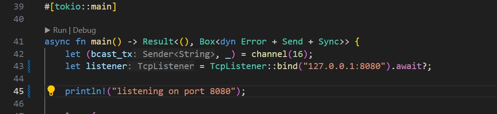

# MODULE 10 - TUTORIAL 2

## 2.1. Original code of broadcast chat.

How to run it: I set up the code of client.rs and server.rs into the bin folder inside src, then run the server.rs first in a command terminal using `cargo run --bin server`. After that open up 3 other command terminals to run the client.rs using `cargo run --bin client`. 
After each client cargo runs, the server terminal will establish a port to that client, each having a the same localhost but different ports.
```cmd
New connection from 127.0.0.1:52185
New connection from 127.0.0.1:52186
New connection from 127.0.0.1:52187
``` 
Each client can send messages to the server. When a client sends a message (by typing it) it will show up on the server terminal, and also on the client terminals themselves (each client get sent other client's messages). The terminal's notification of the messages also notify which client port it came from.

## 2.2. Modifying the websocket port
`src/bin/server.rs`

`src/bin/client.rs`

Result

As seen above, changing the port to 8080 does not change the running result, it still functions the same as before.
Both the client and server uses the same websocket protocol that is the `tokio_websockets` protocol. It ensures that the two connections matchup. The `tokio_websockets` crate provides an implementation of WebSocket functionality on top of Tokio, which is a popular asynchronous runtime for Rust.

## 2.3. Small changes. Add some information to client
`client.rs`

This loop concurrently listens for incoming messages from a WebSocket stream and input from the standard input, allowing the program to respond to both WebSocket messages and user input asynchronously.
We put this text here as part of the logging or debugging mechanism to visually identify messages received from the server. By prefixing each message with `"Radhitya's Computer - From server: "`, it's easier to distinguish server messages from other types of messages, especially in scenarios where multiple sources may be sending messages.

`server.rs`

This loop accepts incoming connections, spawns a new asynchronous task to handle each connection, and then repeats the process indefinitely. Each spawned task handles one connection, allowing the server to handle multiple concurrent connections efficiently. The server here will accept incoming connections and print the out the localhost and port along with it.

Result

